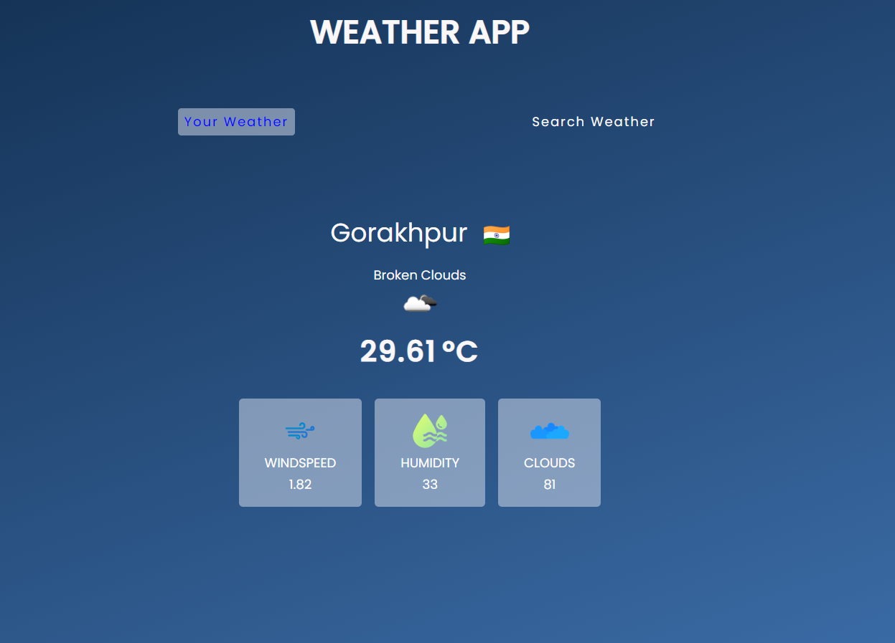

# Weather App

This provides accurate weather information based on location. This app will also provide rain forecast,
 humidity information, temperatures of the day and hourly temperature for a location.

The weather app also provides atmospheric pressure, weather conditions, visibility distance,
 relative humidity, precipitation in different unites, dew point, wind speed and direction

## Screenshots

# Home Screen - grant Location Acess

# Current Location Weather

# Search Weather for any location
# Delhi 

# Maldives

